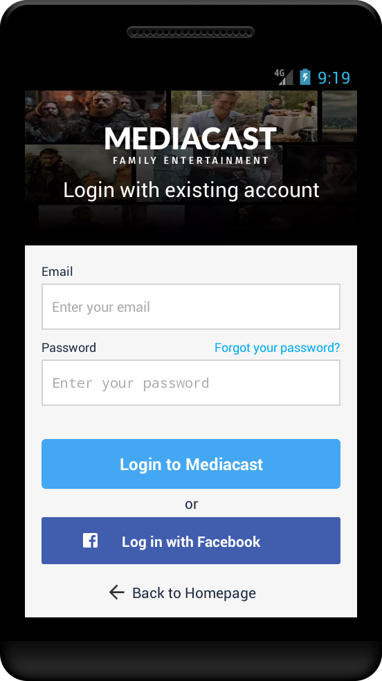
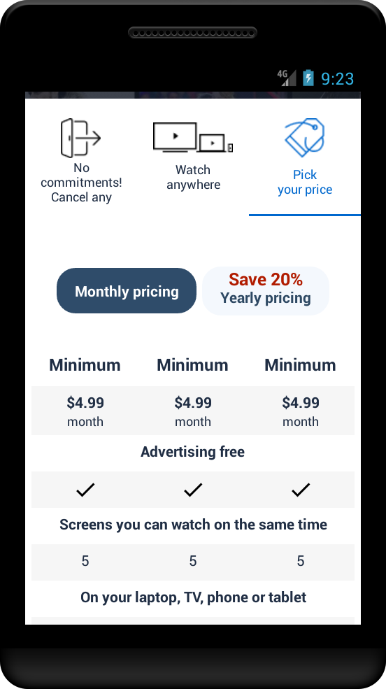
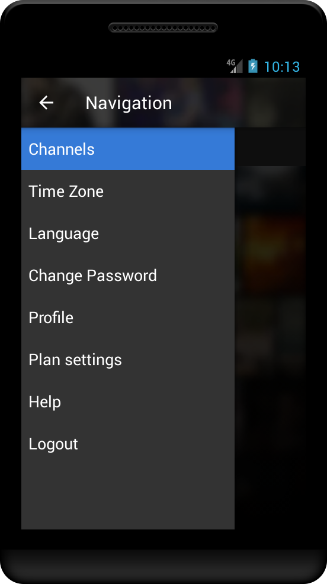
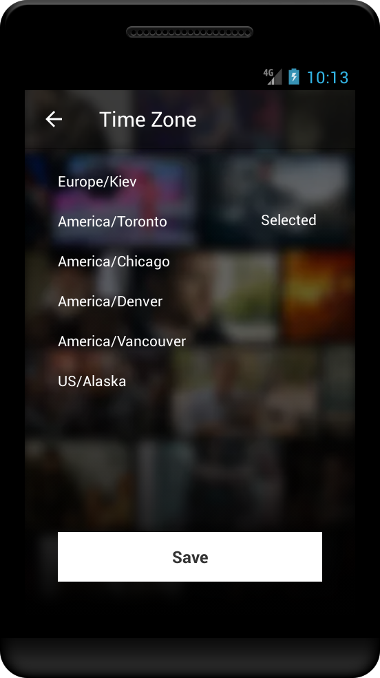
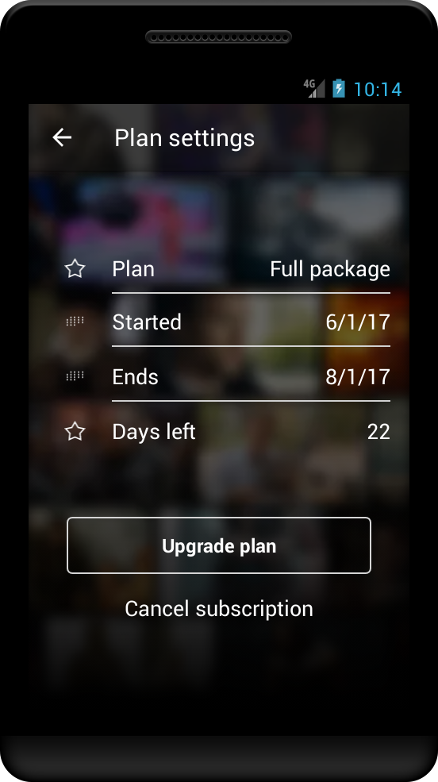
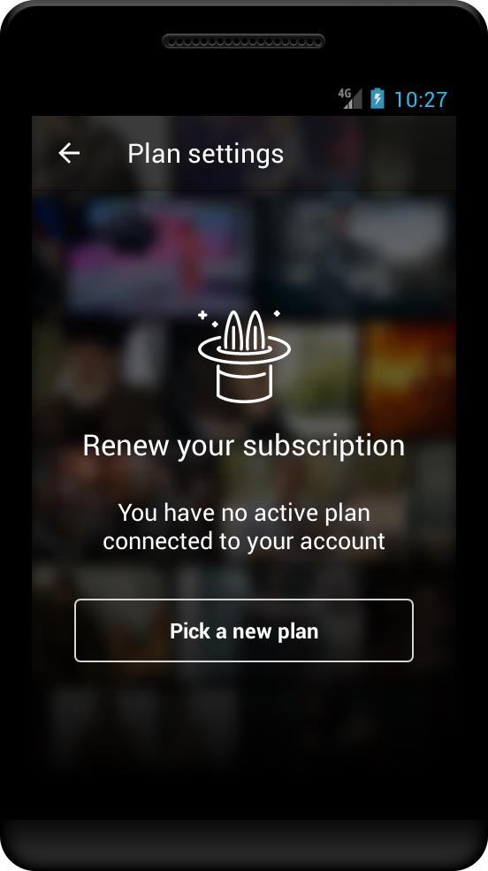
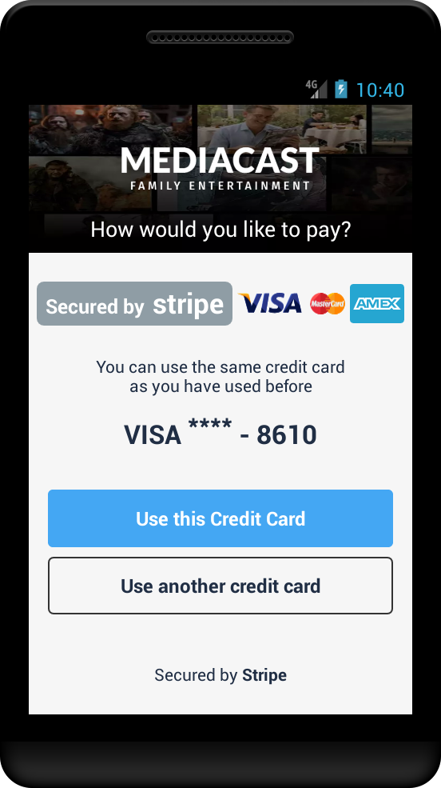

# android_iptv
### An Android application for watching TV-channels both live and 2-weeks archived.  

Features:  
* client-server
* 2 mode login/register - via Facebook or e-mail
* Stripe payment flow
* editing personal info
* changing language of the app or time zone of translations
* (In-app Billing and AndroidPay - both unfinished)  

The app cannot be demonstrated because it is not on Play Store and server is off at the moment. 
A gif-movie shows it in action.  

This version of code is partially obfuscated to hide some sensitive parts 
and thus cannot compile.  

The reason of bad structure is that I am not the one who started it. 
I was hired on the basis of adding features to then existing version of the app.
But in this version is only 5-7% of code that is not mine.  
Thus current version of the app is more than 90% written by me.

Classes which are not mine:
* ActivityCalendar - though my modernization in it is more than 70% 
* ActivityExoPlayer - though my modernization in it is more than 30%
* ActivityNavigation - my modernization in it is only about 5%
* FragmentChannels - my modernization in it is only about 5%
* FragmentChannelsUkr- though my modernization in it is more than 60%
* NavigationDrawerFragment - my modernization in it is only about 5%  

The all other classes are totally made by me.  
All layouts in the project are made by me.  

